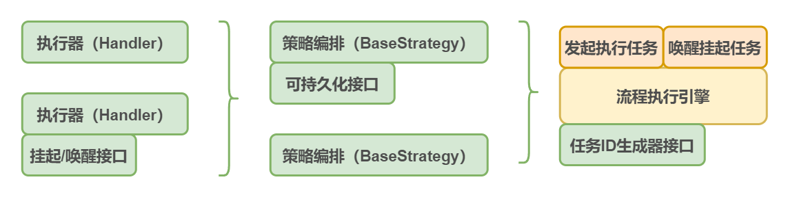
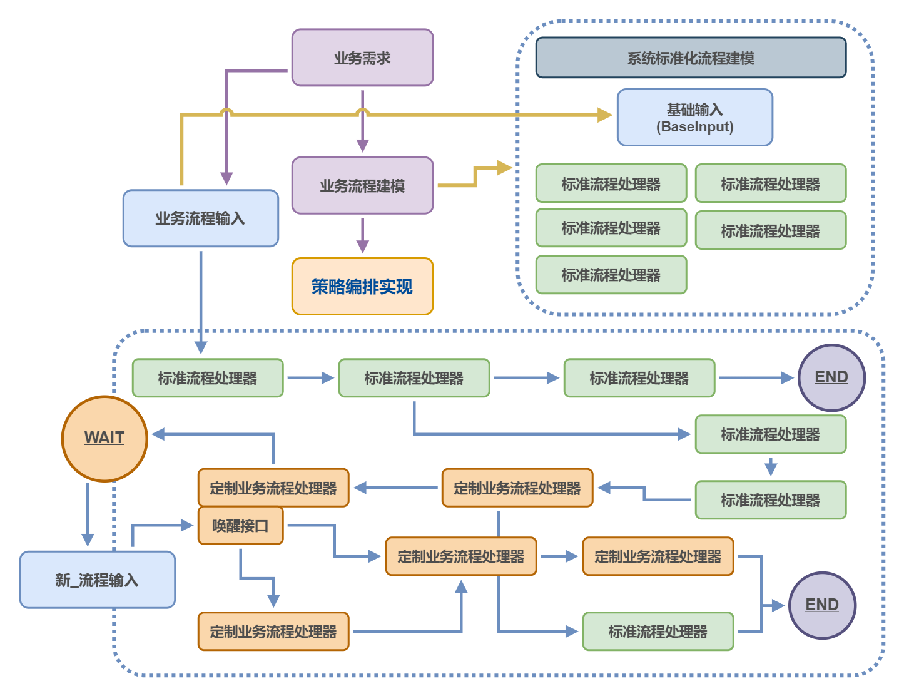
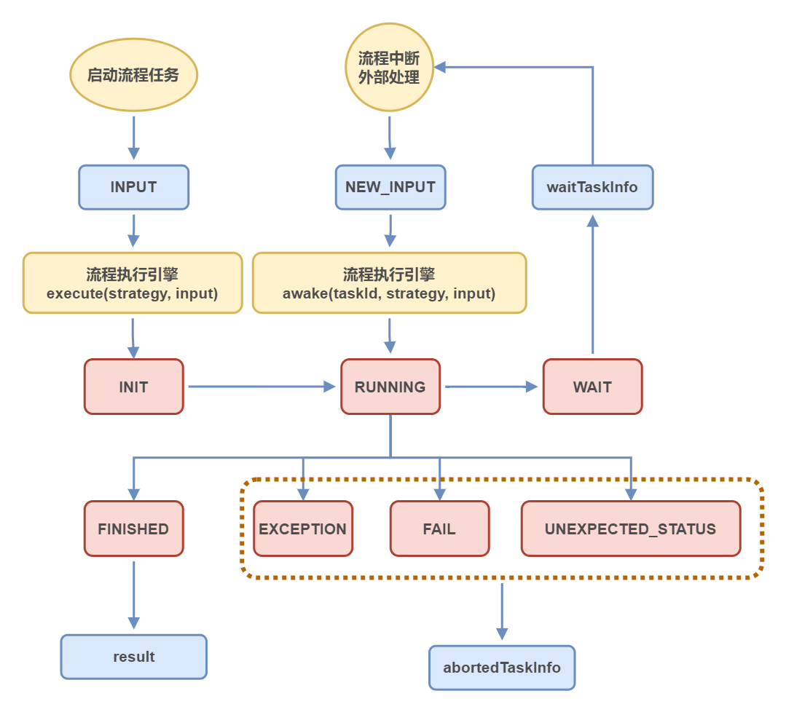
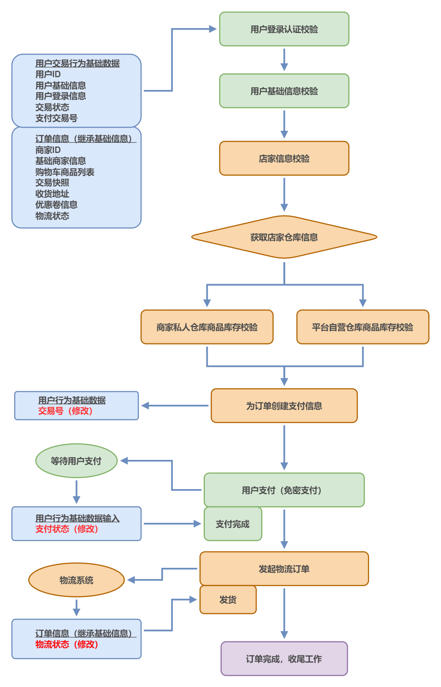

# ArgFlow

> 文档编写中，若有疏漏可以提 issue
> 
> 还没有打包到 Maven 仓库，因为还没人用（需要的话可以自己本地测试之后提 issue）

ArgFlow 是一个基于状态机模式的，轻量级内嵌式 Spring 可编排流程引擎组件，提供简洁易懂的 API，帮助开发者设计清晰明了的流程。

## 功能支持（API）：

- 基于 BeanId 的直观简洁的流程编排
- 多分支流程编排，直观的规则树设计
- 支持任务中断挂起和唤醒
- 支持流程任务持久化记录接口
- 自定义任务ID生成器接口

特性：
- 默认 LRU 缓存存储流程任务
- 默认迷雾算法生成分布式 ID（不完全可靠）

## 设计思想：

[博客-设计一个流程编排引擎](https://blog.mydawn.space/archives/gzvOR59J)

当一个新的业务流程进入标准化业务时，我们可以依据标准化流程建模来设计业务的流程模型，依照流程模型，拆分出不相互依赖的流程节点，并设计定制化流程编排，以实现低耦合，高扩展的流程开发。

举例来说，这是一个标准化系统中设计一个流程策略的思路。

流程编排是流程的静态形式，流程任务是流程的动态形式，每一次执行流程都会创建一个流程任务，而一个流程任务的生命周期如下图所示。

## 快速开始

> 具体代码在 `spring-example` module 中

如下一个简单的下单流程的示例，实际代码在 DemoStrategy 中。

DemoStrategy.java 会详细展示如何使用这个流程引擎完成：
- 编排流程节点
- 实现流程分支
- 整合节点输出
- 流程任务的挂起和唤醒

